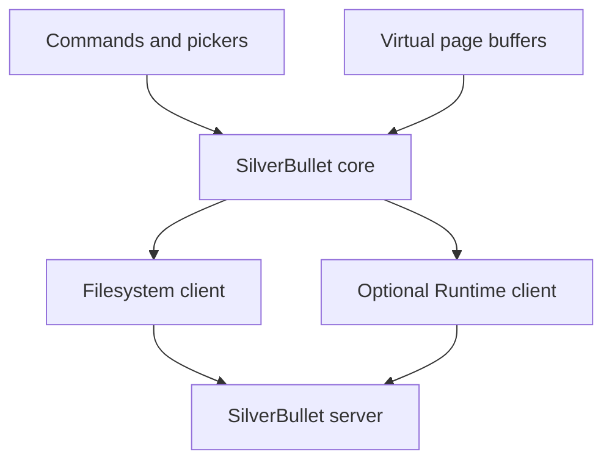

# `silverbullet.nvim` Implementation Plan

## Objective

Build a Neovim plugin that treats a SilverBullet space as a remote Markdown workspace. The plugin should support normal Neovim buffers and `:write`, protect against concurrent browser edits, and optionally use SilverBullet's Runtime API for indexed features such as backlinks, tasks, anchors, queries, and page-aware refactoring.

The recommended approach is to implement remote Markdown editing first and layer SilverBullet-aware functionality on top. Basic editing must not depend on the Runtime API.

## Version and API strategy

Stable SilverBullet 2.9 supports filesystem CRUD and metadata through `/.fs`, but it does not yet provide atomic conditional writes. Current SilverBullet edge builds add `ETag` and `If-Match` support, while SilverBullet 2.10 removes the transitional `/.runtime/objects/*` endpoint in favor of `sb query`, `sb eval`, and `sb script`.

The plugin should therefore detect server capabilities rather than assuming one exact SilverBullet version.

Primary references:

- [SilverBullet 2.9 HTTP API](https://github.com/silverbulletmd/silverbullet/blob/2.9.0/website/HTTP%20API.md)
- [Current HTTP API](https://github.com/silverbulletmd/silverbullet/blob/main/docs/HTTP%20API.md)
- [Runtime API](https://github.com/silverbulletmd/silverbullet/blob/main/docs/Runtime%20API.md)
- [CLI](https://github.com/silverbulletmd/silverbullet/blob/main/docs/CLI.md)
- [Changelog](https://github.com/silverbulletmd/silverbullet/blob/main/CHANGELOG.md)

## 1. Initial scope

### MVP goals

The first usable release should support:

- Connecting to one or more SilverBullet spaces
- Listing and fuzzy-finding pages
- Opening remote pages as Neovim buffers
- Creating and saving pages
- Deleting pages with confirmation
- Following `[[wiki links]]`
- Opening the current page in the browser
- Detecting remote changes before overwriting them
- Clear authentication, network, proxy, and read-only errors
- A `:checkhealth silverbullet` implementation

### Explicitly deferred features

Do not include these in the first release:

- Offline synchronization
- Automatic backlink rewriting without SilverBullet's Runtime API
- General attachment management
- Image pasting
- Task mutation
- Full SilverBullet rendering
- Reimplementing SLIQ inside Neovim
- Resolving `$anchors` without the Runtime API

These features add substantial complexity without being necessary to prove the core workflow.

### Compatibility targets

- Neovim 0.10 or newer
- SilverBullet 2.9 or newer
- `curl` available on `PATH`
- Linux and macOS initially
- Windows after transport and temporary-file behavior have been tested

Use only core Neovim APIs as mandatory runtime dependencies. Telescope, `nvim-cmp`, Blink, and similar plugins should be optional integrations.

## 2. Architecture



Maintain a strict separation between:

- Neovim commands, pickers, and buffers
- SilverBullet page semantics
- HTTP transport
- Filesystem API operations
- Optional Runtime API queries

This allows a local filesystem backend to be added later without rewriting the editor-facing functionality.

## 3. Repository structure

```text
silverbullet.nvim/
├── plugin/
│   └── silverbullet.lua
├── lua/
│   └── silverbullet/
│       ├── init.lua
│       ├── config.lua
│       ├── commands.lua
│       ├── health.lua
│       ├── log.lua
│       ├── uri.lua
│       ├── async.lua
│       ├── state.lua
│       ├── buffer.lua
│       ├── pages.lua
│       ├── links.lua
│       ├── completion.lua
│       ├── conflict.lua
│       ├── picker/
│       │   ├── init.lua
│       │   ├── builtin.lua
│       │   └── telescope.lua
│       ├── transport/
│       │   └── curl.lua
│       ├── client/
│       │   ├── fs.lua
│       │   └── runtime.lua
│       └── integrations/
│           ├── cmp.lua
│           └── blink.lua
├── doc/
│   └── silverbullet.txt
├── tests/
│   ├── minimal_init.lua
│   ├── unit/
│   ├── integration/
│   └── fixtures/
├── scripts/
│   └── test
├── README.md
├── LICENSE
└── stylua.toml
```

`plugin/silverbullet.lua` should only register commands and autocommands. It must not perform network requests during Neovim startup.

## 4. Configuration API

Support multiple named spaces from the beginning:

```lua
require("silverbullet").setup({
  default_space = "personal",

  spaces = {
    personal = {
      url = "https://bullet.example.com",

      auth = {
        token_env = "SILVERBULLET_TOKEN",
      },

      runtime = {
        enabled = false,
      },
    },
  },

  transport = {
    timeout_ms = 10000,
    executable = "curl",
  },

  cache = {
    page_list_ttl_ms = 5000,
  },

  conflict = {
    check_on_focus = true,
    check_before_write = true,
  },

  picker = {
    provider = "auto",
  },
})
```

Supported credential providers should eventually include:

```lua
auth = {
  token_env = "SILVERBULLET_TOKEN",
}
```

```lua
auth = {
  token = function()
    return require("my_secrets").silverbullet_token()
  end,
}
```

```lua
auth = {
  command = { "op", "read", "op://Personal/SilverBullet/token" },
}
```

Avoid encouraging users to place a literal token in their Neovim configuration. Validate configuration during `setup()`, but resolve credentials only immediately before making a request.

## 5. SilverBullet API client

### Required endpoints

| Operation | Endpoint |
| --- | --- |
| Connectivity | `GET /.ping` |
| Server configuration | `GET /.config` |
| File listing | `GET /.fs` |
| Read page | `GET /.fs/{path}` |
| Read metadata | `GET /.fs/{path}` with `X-Get-Meta: true` |
| Write page | `PUT /.fs/{path}` |
| Delete page | `DELETE /.fs/{path}` |
| Runtime expression | `POST /.runtime/lua` |
| Runtime script | `POST /.runtime/lua_script` |

All filesystem requests should include:

```text
X-Sync-Mode: true
Authorization: Bearer <token>
```

For current edge versions, also send:

```text
X-Client-Id: silverbullet.nvim-<session-id>
X-Source: external
```

Older versions should safely ignore those headers.

### File metadata model

```lua
---@class SilverBulletFileMeta
---@field name string
---@field created integer|nil
---@field last_modified integer|nil
---@field content_type string|nil
---@field size integer|nil
---@field permission "rw"|"ro"|nil
---@field etag string|nil
```

The listing response contains fields such as `name`, `lastModified`, `contentType`, `size`, and `perm`. Individual file responses can return:

- `ETag`
- `X-Created`
- `X-Last-Modified`
- `X-Content-Length`
- `X-Permission`
- `Content-Type`

Preserve unknown metadata fields internally so future server additions do not require immediate plugin changes.

### Path handling

Create one central path encoder. It must:

- Preserve `/` separators
- Encode each path segment individually
- Encode spaces, `#`, `?`, `%`, and Unicode correctly
- Reject `..`
- Reject absolute paths
- Prevent paths escaping the space
- Add `.md` only for page operations, not attachments

Test paths such as:

```text
index.md
Projects/Finnova.md
Meeting Notes/Review.md
ümlaut/Grüsse.md
Page #1.md
percent%page.md
```

## 6. Curl transport

Use `vim.system()` rather than shell command strings. Never build requests with `sh -c`.

Normalize every response:

```lua
---@class SilverBulletResponse
---@field status integer
---@field headers table<string,string>
---@field body string
---@field stderr string
```

Avoid passing tokens as command-line arguments because they can appear in process listings. A practical design is:

- Pass headers to `curl` over standard input using `-H @-`
- For PUT bodies, write content to a mode-`0600` temporary file
- Delete the temporary file immediately after the request
- Never log authentication headers
- Redact bearer tokens from every error path

Do not follow redirects automatically. A redirect to Authelia should be reported as middleware interception instead of followed until the plugin receives an HTML login page.

Recognize and translate:

- `200`: success
- `401`: invalid or missing SilverBullet authentication
- `403`: authentication failure or read-only page/server
- `404`: missing page
- `412`: concurrent-update conflict
- `3xx`: reverse-proxy authentication or incorrect base URL
- HTML where JSON was expected: likely authentication page
- `5xx`: server or Runtime API failure

TLS verification should remain enabled. Support a custom CA:

```lua
tls = {
  ca_file = "/path/to/private-ca.pem",
}
```

Do not document `--insecure` as a normal configuration.

## 7. Virtual page buffers

Use buffer names such as:

```text
silverbullet://personal/Projects/Finnova.md
```

Register:

- `BufReadCmd silverbullet://*`
- `BufWriteCmd silverbullet://*`

Configure an opened page buffer with:

```lua
vim.bo[buf].buftype = "acwrite"
vim.bo[buf].filetype = "markdown"
vim.bo[buf].swapfile = false
vim.bo[buf].bufhidden = "hide"
```

Store internal state by buffer number:

```lua
---@class SilverBulletBufferState
---@field space string
---@field path string
---@field base_content string
---@field base_hash string
---@field etag string|nil
---@field last_modified integer|nil
---@field permission "rw"|"ro"
---@field writing boolean
```

### Read lifecycle

1. Validate and normalize the path.
2. Create or reuse the corresponding buffer.
3. Fetch its contents.
4. Populate the buffer without marking it modified.
5. Record content, hash, ETag, and metadata.
6. Set the buffer read-only when `X-Permission` is `ro`.
7. Restore the session's previous cursor position when available.

Preserve whether the remote content ends with a newline and set `endofline` appropriately.

### Write lifecycle

Initial writes should be synchronous with a strict timeout. Page-list fetching and pickers can be asynchronous, but `:write` must not return successfully before the server has accepted the content.

1. Ensure no previous write is active.
2. Serialize the buffer, preserving its final newline.
3. Check whether the remote version changed.
4. Write with the strongest supported precondition.
5. Update stored metadata and baseline content.
6. Clear the buffer's modified flag.
7. Emit `User SilverBulletWritePost`.

Never clear `modified` after a failed request.

## 8. Concurrent-edit protection

This is the most important correctness feature.

### Servers supporting ETags

Store the ETag returned when a page is read. Write existing pages with:

```text
If-Match: "<previous-etag>"
```

Create new pages with:

```text
If-None-Match: *
```

A `412 Precondition Failed` means another client changed the page. Never retry the PUT automatically without the condition.

### SilverBullet 2.9 fallback

Because 2.9 does not provide conditional writes:

1. Store a hash of the initially fetched content.
2. Immediately before PUT, fetch the current remote content.
3. Compare its hash with the baseline.
4. Refuse the write if they differ.
5. PUT only when they match.

This leaves a small time-of-check/time-of-use race. Document that complete overwrite protection requires a server supporting `If-Match`.

### Conflict interface

When a conflict is detected, offer:

- `Show diff`
- `Reload remote`
- `Force overwrite`
- `Cancel`

`Show diff` should:

- Keep the local buffer untouched
- Open the remote version in a read-only scratch buffer
- Enable Neovim diff mode
- Provide a command to accept the remote version
- Require a second explicit action for force-overwrite

A later release can add three-way merging based on baseline, local, and current remote content. Do not make Git a mandatory dependency solely for `git merge-file`.

### Detecting external edits

Initially check the current page on:

- `FocusGained`
- `BufEnter`
- Immediately before writing

If the buffer is clean and the remote page changed, reload it while preserving the cursor. If it is modified, warn and leave it untouched. A configurable polling timer can be added later.

## 9. Commands and workflows

Initial commands:

```vim
:SilverBulletHealth
:SilverBulletFind
:SilverBulletOpen {page}
:SilverBulletNew {page}
:SilverBulletReload
:SilverBulletDelete
:SilverBulletFollowLink
:SilverBulletOpenWeb
:SilverBulletHome
```

Later commands:

```vim
:SilverBulletBacklinks
:SilverBulletTasks
:SilverBulletQuery
:SilverBulletRename
:SilverBulletDaily
```

Do not define opinionated default keymaps. Expose `<Plug>` mappings:

```text
<Plug>(SilverBulletFind)
<Plug>(SilverBulletFollowLink)
<Plug>(SilverBulletBacklinks)
<Plug>(SilverBulletOpenWeb)
```

## 10. Page picker

The core picker should use `vim.ui.select()` to avoid a hard dependency.

After fetching `GET /.fs`:

1. Keep files ending in `.md`.
2. Prefer `contentType == "text/markdown"` when available.
3. Remove `.md` for display.
4. Retain the full path internally.
5. Score exact basename, prefix, path component, and fuzzy matches.
6. Use recency only as a weak tiebreaker.

Cache the listing briefly and invalidate it after create, delete, or rename.

Add Telescope later using the same page-list service. Do not put transport logic in the Telescope adapter.

## 11. Wiki-link navigation

Support:

```markdown
[[Page]]
[[Folder/Page]]
[[Page|Displayed name]]
[[Page#Heading]]
[[$anchor]]
```

For the first release:

- `[[Page]]`: open `Page.md`
- `[[Page|Alias]]`: open the part before `|`
- `[[Page#Heading]]`: open the page and jump to its heading
- `[[$anchor]]`: require Runtime API or show a clear unsupported message

Implement link extraction as a small parser rather than one broad regular expression.

Following a link should:

1. Determine the cursor byte position.
2. Find the surrounding wiki-link.
3. Parse page, alias, heading, and anchor.
4. Open the page.
5. Jump to the requested heading.
6. Create an unsaved empty buffer when the target does not exist.

## 12. Completion

Start with a built-in omnifunc or manual completion inside `[[...]]`.

Completion sources:

- Page names from the cached file listing
- Headers from the target page
- `$anchors` through Runtime API when available

Then expose optional adapters for:

- `nvim-cmp`
- Blink
- Mini completion

Keep completion logic framework-independent:

```lua
pages.complete(prefix, callback)
```

## 13. Optional Runtime API

The Runtime API executes queries inside a headless SilverBullet client and requires Chromium. SilverBullet's standard container does not include Chromium, so this must remain optional.

Use:

```text
POST /.runtime/lua
POST /.runtime/lua_script
```

Do not depend on `/.runtime/objects/*`. Use `query`, `eval`, or `script` instead.

Runtime-backed features can include:

- Backlinks
- Task listing
- Tag search
- Object inspection
- `$anchor` resolution
- Schema descriptions
- SilverBullet-aware page rename
- Arbitrary SLIQ queries

### Safe query construction

Never interpolate page names directly into Lua source. Implement and test a Lua-literal serializer:

```lua
runtime.literal("Page \"One\"")
```

Test quotes, backslashes, newlines, control characters, and Unicode.

### Rename behavior

Do not implement rename as `PUT new + DELETE old`, because that leaves backlinks pointing to the old page.

With Runtime API enabled, invoke SilverBullet's own rename/refactoring function so references are updated. Without Runtime API, either disable rename or expose a distinctly named raw file-move operation.

## 14. Authelia deployment

Authelia may intercept terminal requests before SilverBullet sees the bearer token.

A clean Traefik deployment is:

- A higher-priority router for `/.fs` and optionally `/.runtime`
- No Authelia middleware on that router
- Requests remain protected by SilverBullet's `SB_AUTH_TOKEN`
- HTTPS remains mandatory
- The regular browser route continues through Authelia

The health check should recognize a redirect or HTML login page and explain it precisely:

```text
The server redirected /.fs to an HTML login page.
Your reverse-proxy authentication middleware may be intercepting API requests.
```

## 15. Health checks

Implement `:checkhealth silverbullet` with:

1. Neovim version
2. `curl` availability and version
3. Configuration validation
4. Credential-provider availability
5. `GET /.ping`
6. Authenticated `GET /.config`
7. Authenticated `GET /.fs`
8. Read-only state
9. ETag capability when observable
10. Runtime API availability when enabled
11. Redirect and Authelia detection
12. Custom CA readability

Never print tokens or authentication headers.

## 16. Testing strategy

### Unit tests

Cover:

- Path validation and URL encoding
- Page-name to file-path conversion
- Wiki-link parsing
- Header and anchor parsing
- HTTP-header normalization
- File-list parsing
- Final-newline preservation
- Conflict decision logic
- Lua-literal serialization
- Configuration validation
- Credential redaction

### Transport tests

Use a lightweight test HTTP server for:

- Successful GET, PUT, and DELETE
- Nested and Unicode paths
- `401`, `403`, `404`, and `412`
- Redirect to a login page
- HTML returned instead of JSON
- Timeout
- Broken JSON
- Read-only metadata
- ETag-capable and non-ETag behavior

### Real SilverBullet integration tests

Run against:

- SilverBullet 2.9
- Current stable
- Edge, initially allowed to fail but reported

Test the full sequence:

1. Create a page.
2. Locate it in the listing.
3. Open it in a Neovim buffer.
4. Modify and save it.
5. Verify server contents.
6. Modify it externally.
7. Confirm Neovim refuses to overwrite it.
8. Delete it.
9. Confirm it disappeared.

Run Neovim headlessly:

```bash
nvim --headless -u tests/minimal_init.lua \
  -c "lua MiniTest.run()" \
  -c "qa"
```

CI matrix:

- Neovim 0.10
- Neovim 0.11
- Neovim nightly
- Linux mandatory
- macOS where practical

## 17. Implementation milestones

| Milestone | Deliverable | Estimate |
| --- | --- | ---: |
| 0 | API and Authelia connectivity spike | 0.5–1 day |
| 1 | Repository, configuration, and health checks | 1 day |
| 2 | Curl transport and `/.fs` client | 1–2 days |
| 3 | Virtual-buffer read/write lifecycle | 2 days |
| 4 | Page picker and wiki-link navigation | 1–2 days |
| 5 | Conflict detection and diff UI | 2–3 days |
| 6 | Completion and browser integration | 1–2 days |
| 7 | Optional Runtime API features | 2–4 days |
| 8 | CI, documentation, and first release | 1–2 days |

A credible CRUD and navigation MVP is approximately 7–10 focused development days. A polished release with Runtime features is closer to 12–18 days.

## 18. Release progression

### `0.1.0`

- Multiple remote spaces
- Find, open, create, save, and delete
- Basic conflict prevention
- Wiki-link following
- Health checks

### `0.2.0`

- Telescope integration
- Completion
- External-change detection
- Better diff workflow
- Multiple-space switching UI

### `0.3.0`

- Runtime API
- Backlinks
- `$anchor` resolution
- Tasks and SLIQ queries
- SilverBullet-aware rename

### `1.0.0`

- Stable documented Lua API
- Tested stable and edge compatibility
- Robust conflict behavior
- Secure credential handling
- Linux, macOS, and Windows support
- Migration policy for SilverBullet API changes

## Definition of done for the MVP

The MVP is complete when:

- A remote page can be found, opened, edited, and saved naturally with `:write`.
- Spaces, nested paths, and Unicode filenames work.
- The plugin never silently overwrites a detected remote change.
- Tokens never appear in logs, notifications, or process arguments.
- Authelia redirects produce a useful diagnosis.
- Runtime API is not required for basic editing.
- The plugin has no mandatory Neovim-plugin dependencies.
- CRUD behavior is tested against SilverBullet 2.9 and current stable.
- Errors preserve the modified buffer so user content cannot disappear.

